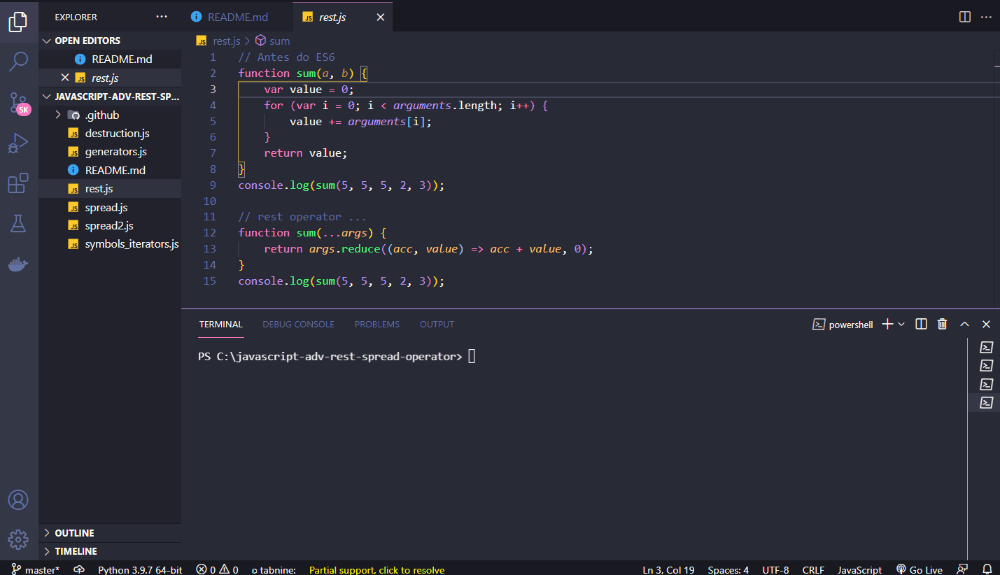
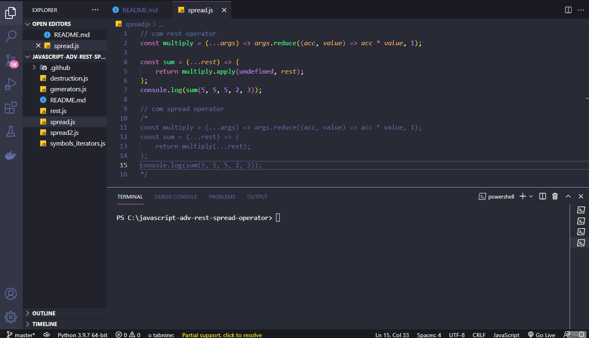
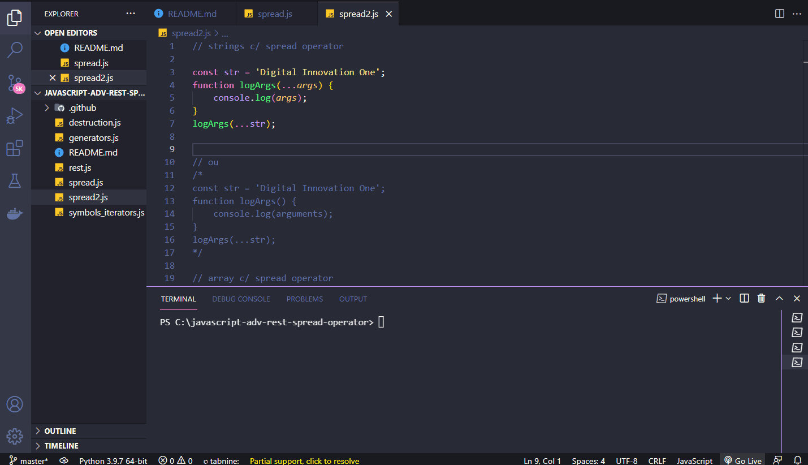
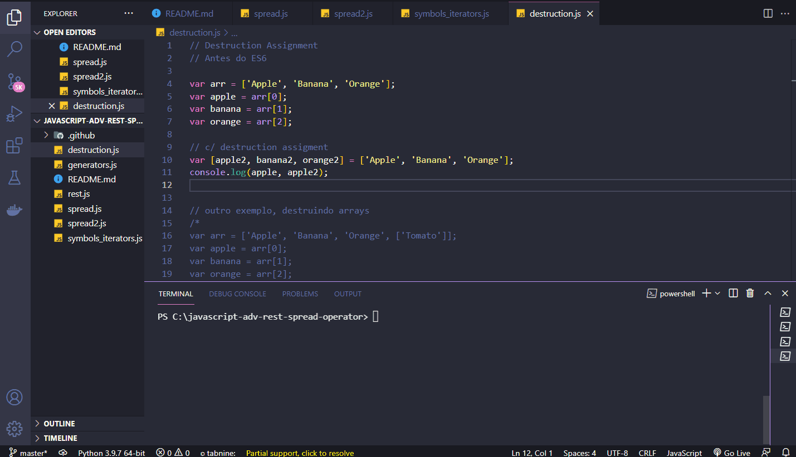
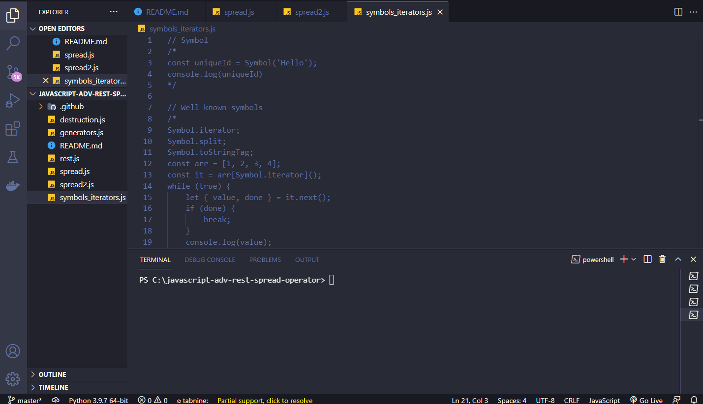
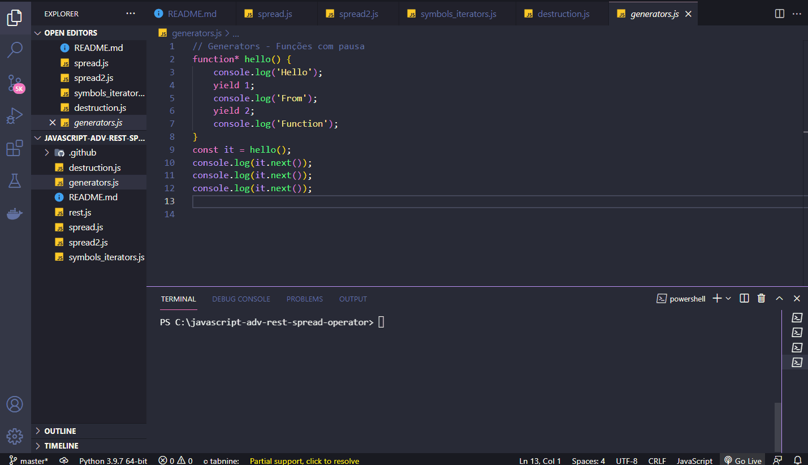

<h1 align="center">
  
   
  JavaScript ES6 - Advanced ES6 1/2
</h1>

<h3 align="justify">
Didactic demonstration of advanced JavaScripty ES6 functions. Credits for the Digital Innovation One Essential ES6 JavaScript module.
</h3>

 

## 📷 Demonstration

<h4 align="left"> rest </h4>
  
   
<h4 align="left" > spread </h4>  
  
   
<h4 align="left" > spread2 </h4>  
  
   
<h4 align="left"> destruction </h4>
  
   
<h4 align="left"> symbols & iterators </h4>
  
   
<h4 align="left"> generators </h4>
  
   

 

## 🚀 Technologies

This project was developed with the following technologies:

- JavaScript ES6
- NodeJS

 

## ⚙ Operators
- rest
- spread
- symbols
- iterators
- destruction
- generators

 

---

Made with 💜 by Rafael Maciel
